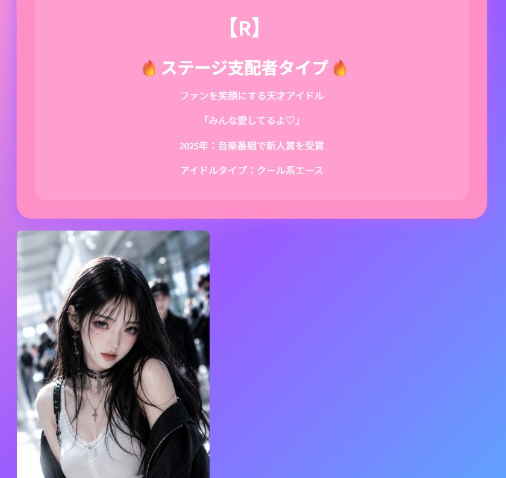

# 推しドルメーカー

あなたを韓国アイドル風に診断し、ファン数や好感度を育てていく
**診断 × 育成 × ガチャ要素つきのStreamlitアプリ** です。

ニックネーム・好きな色・性格・なりたい雰囲気を選ぶことで、
自分だけのアイドルプロフィールが作成されます。

## 公開アプリ

以下のURLからアプリを遊べます。

https://oshi-dol-maker.streamlit.app

## アプリ概要

「推しドルメーカー」は、ユーザーを架空のK-POPアイドル風に診断し、
その後の活動によってファン数や好感度を伸ばしていく育成アプリです。

診断結果には、アイドル名・所属グループ・ポジション・レア度・コンセプトなどが表示されます。
さらに、SNS投稿、レッスン、ライブツアー、衣装ガチャなどのアクションを通して、
トップスターやワールドスターを目指して遊ぶことができます。

## 主な機能

### アイドル診断

* ニックネーム入力
* 好きな色の選択
* 性格の選択
* なりたい雰囲気の選択
* アイドル名・グループ名・ポジションを自動生成
* レア度つき診断結果を表示

### 育成機能

* ファン数の増減
* 好感度の増減
* レベルアップ
* アイドルランク表示
* 称号システム
* 人気度・好感度のプログレスバー表示

### アクション機能

* 今日の活動
* ログインボーナス
* SNS投稿
* レッスン
* スキャンダル対応
* ライブツアー

### 衣装機能

* 衣装ガチャ
* 衣装レベルアップ
* 所持衣装コレクション
* 衣装かぶり時のボーナス

### その他の機能

* エンディング機能
* 活動ログ
* リセット機能
* タブによる画面整理
* PC表示に対応したワイドレイアウト

## 遊び方

1. 「診断」タブでニックネームや好みを入力します。
2. 「診断する」ボタンを押して、アイドルプロフィールを作成します。
3. 「育成」タブで活動・SNS投稿・レッスンなどを行います。
4. 「衣装」タブで衣装ガチャや衣装レベルアップを楽しみます。
5. ファン数を増やして、エンディングを目指します。
6. 「ログ」タブで活動履歴を確認できます。

## 使用技術

* Python
* Streamlit
* GitHub
* Streamlit Community Cloud

## ファイル構成

```text
oshi_dol_maker/
├── app.py
├── requirements.txt
├── README.md
├── idol_n.png
├── idol_r.png
├── idol_sr.png
├── idol_ssr.png
└── idol_ur.png
```

## ローカルでの実行方法

1. このリポジトリをダウンロードまたはクローンします。
2. 必要なライブラリをインストールします。

```bash
pip install -r requirements.txt
```

3. アプリを起動します。

```bash
streamlit run app.py
```

## 今後追加したい機能

* 診断結果の画像保存機能
* SNS共有ボタン
* さらに多い衣装・称号・イベント
* 推しカード風デザイン
* スマホ表示の最適化

## 作者

推しドルメーカー制作プロジェクト

## アプリ画面




